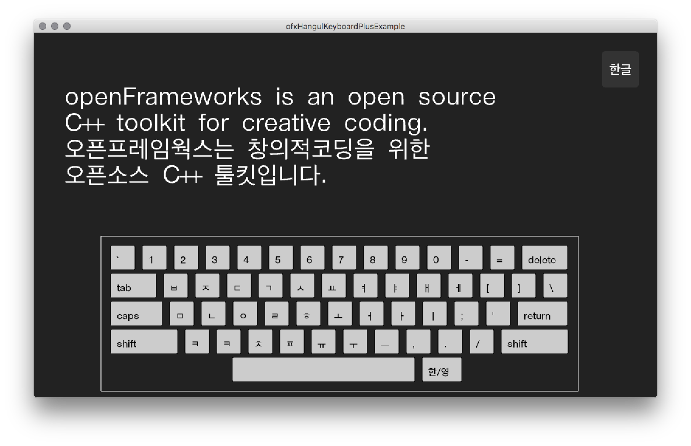

# ofxHangulKeyboardPlus

오픈프레임웍스에서 동작하는 한글입력기입니다. 
하드웨어 키보드입력및 가상키보드 입력을 지원합니다.

## 지원 환경
- 맥OS Sierra 10.12.4 / 오픈프레임웍스 0.9.8
- 윈도우는 지원되지 않습니다.

## 참조한 공개된 소스
- [한글-오토마타-만들기 by 맛있는님](http://codepedia.tistory.com/entry/%ED%95%9C%EA%B8%80-%EC%98%A4%ED%86%A0%EB%A7%88%ED%83%80-%EB%A7%8C%EB%93%A4%EA%B8%B0)
- [ofxSoftKeyboard](https://github.com/Lensley/ofxSoftKeyboard)

## 필요 애드온
- [ofxMSAInteractiveObject](https://github.com/memo/ofxMSAInteractiveObject)
- [ofxTrueTypeFontUC](https://github.com/hironishihara/ofxTrueTypeFontUC)

## bug fixed 
- 가상키보드에서 쌍자음 입력가능. : 자음 연속 입력
- 키보드 한글키 ㅌ 수정 

## TODO
- 가상키보드에서 ~~쌍자음~~대문자 입력
- Shift키 및 capslock 키 구현 

## 라이센스
MIT 허가서

Copyright (c) 2017 Yi donghoon

Permission is hereby granted, free of charge, to any person
obtaining a copy of this software and associated documentation
files (the "Software"), to deal in the Software without
restriction, including without limitation the rights to use,
copy, modify, merge, publish, distribute, sublicense, and/or sell
copies of the Software, and to permit persons to whom the
Software is furnished to do so, subject to the following
conditions:

The above copyright notice and this permission notice shall be
included in all copies or substantial portions of the Software.

THE SOFTWARE IS PROVIDED "AS IS", WITHOUT WARRANTY OF ANY KIND,
EXPRESS OR IMPLIED, INCLUDING BUT NOT LIMITED TO THE WARRANTIES
OF MERCHANTABILITY, FITNESS FOR A PARTICULAR PURPOSE AND
NONINFRINGEMENT. IN NO EVENT SHALL THE AUTHORS OR COPYRIGHT
HOLDERS BE LIABLE FOR ANY CLAIM, DAMAGES OR OTHER LIABILITY,
WHETHER IN AN ACTION OF CONTRACT, TORT OR OTHERWISE, ARISING
FROM, OUT OF OR IN CONNECTION WITH THE SOFTWARE OR THE USE OR
OTHER DEALINGS IN THE SOFTWARE.

